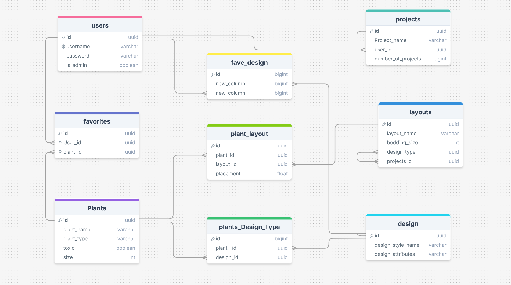

# Plantscape

## Project Task Management:

[https://github.com/orgs/Plantscape-By-L-A-Lifters/projects/1]

## Project Documentation:

[https://docs.google.com/document/d/1uPmO3TS9sah1OT0lKNjBTRXbJmEoNXKCCL-alDLU8r4/edit?tab=t.ikk4qkg9qo7j]

## Project Back-End Organization


[https://drawsql.app/teams/plantscape/diagrams/plantscape]

## Project Spreadsheet:

[https://docs.google.com/spreadsheets/d/1BbEUECMONUHTOjlcwMbj-OUJaEa2LdfhG1ccO3f1cRI/edit?usp=sharing]

## Project Images:

[https://drive.google.com/drive/folders/1cO1zJvKdEZVsmCrbVu5xEHJ73YvLr84j?usp=drive_link]

## Group Working Notes:

### Github Workflow:

[https://github.com/FullstackAcademy/2501-FTB-ET-WEB-AM/blob/main/Github%20-%20Working%20Together/Github%20Workflow.md]

### Workflow Lessons Learned:

1. never commit or push to main when you are collaborating with other people in github.
2. ALWAYS create a branch and make sure you have your branch checked out while you are working.
3. Periodically push the branch and
4. when your done with the part of the feature your working on, do a final branch push and then go to github to make a pull request.
5. When you make a pull request, main should ALWAYS be the base.
6. You should never see this message:
   ``On branch main
Your branch is ahead of 'origin/main' by 2 commits.`
7. A super helpful command if you want to see all updates that have been pushed since you created your branch, you can use:
   `git fetch`
   (this is different than a pull, and doesn't require you to change out of the branch you are working on!)
8. Best practice for naming a branch, example: `ccruz/image-update`
9. If you want to check what branch you are on, use the "git status" command. the very first line it prints out is your branch.

````chelseacruz@chelseas-mbp Plantscape % git status
On branch ccruz/update-image```
10. You can do it!


### package.json script notes:

  ####npm run seed
  - seed will always add data, but can insert duplicates if run more than one time
  ####npm run db:reset
  - db:reset is for development period only - and resets everything back to what is hard-coded on the backend be cautious before running it

### image hosting:

our images are hosted on cloudinary - get with chelsea if you want to upload more

## Future Developments:

- 3d development:

- cloudinary (our image host) is in a beta version of 3d lifestyle creation where you can load a 3d file and modify camera settings, etc.
- 3d models can be found on sites like cgtrader.com, or sketchup warehouse. many are free.

- plant icons:
- //add icons like this: https://thenounproject.com/browse/collection-icon/landscape-design-147731/
- check out invoke-ai to make custom icons
- GardenCanvas.jx, FUTURE Optimizations with classical layout in mind:
- Plant placement on garden bed starts with tallest plant type centered at the top of the canvas, it repeats up to bedSize.length%diameter
const tallestPlant = find tallest plant in placedPlants;
plant height determines placement along the Y axis - tallest generally goes at the top. except when trees or vines are incorporated.
const widestPlant = findWidest plant in placed plants and optimize the placement and number of this plant. position it to get the max number.

info would be setup like this:
// {
id: 1,
plant_id: UUID
bed_id: UUID
x: 5, //bedSize.length/2-radius
y: 1, //tallest plant goes in back, so, just diameter/2
plants find by plant_id the following:
name: plant.name
diameter: plant.diameter_min_ft //for now... later we can optimize for range of sizes
height: plant.height_min_ft //for now... later we can optimize for range of sizes
color: "sage_green",
accent_color: "goldenrod",

colors.js find by name the following:
color: color.hexCode;
accent_color: color.hexcode
},

//current plant db
createPlant({
id: uuidv4(),
plant_name: "Japanese Painted Fern",
plant_type: "Herbaceous",
toxic: true,
size: 1,
}),
//future plant db
createPlant({
id: uuidv4(),
plant_name: "Japanese Painted Fern",
plant_technical_name: "",
plant_growth_form: "Herbaceous",
toxic: true,
diameter_min_ft: 1,
diameter_max_ft: 1,
plant_height_min_ft: 1,
plant_height_max_ft: 1,
primary_color: green //ties to colors.js on the front end
accent_color: //ties to colors.js on the front end
sun_requirements: - uses thru table
adaptable_styles: - uses thru table
}),

//current plant db
createPlantLayout({
id: uuidv4(),
plant_id: JPFern.id,
layout_id: newBeginnigs.id,
placement: 78,
}),
//future plant db
createPlacedPlant({
id: uuidv4(),
plant_id: JPFern.id,
layout_id: newBeginnigs.id, <--- change to bed id???
x:
y:
}),
````
